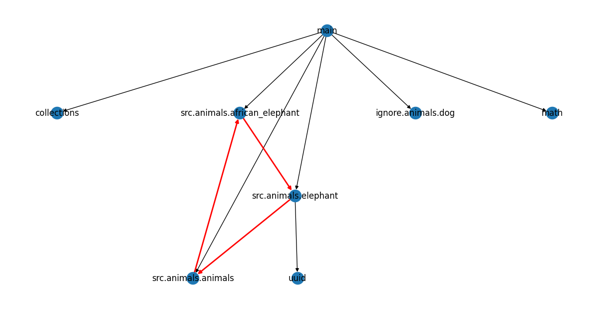

# Dependency Grapher For Python

This is a simple tool to generate a dependency graph for a Python project. It uses the `ast` module to parse the source code and extract the dependencies.<br>
Generated graphs can be used to understand the structure of the project and identify the dependencies between different modules.<br>
Cycle detections are highlighed using red color by the program in the generated graph automatically.

## AIM 

The real purpose of this tool is to generate a dependency graph for a large Python project. These graphs can be used to understand the structure of the project and identify the dependencies between different modules.

## Usage

```bash
python graph_deps.py -r <directory_to_test> -i <ignore_subdir_1> <ignore_subdir_2> .... <ignore subdir n> -sv <scale vertical> -sh <scale horizontal>
```

As a general guideline, it is recommended to ignore the `venv` directories. Otherwise, the tool will try to parse the source code in the virtual environment as well.

## Examples

The following examples demonstrate how to use the tool. The `sample` directory contains a simple Python project for the same.

### Example 1

```bash
python graph_deps.py -r sample -i ignore venv -sv 1 -sh 2
```

The above command will generate a dependency graph for the `sample` directory, ignoring drilling down into file present in the `ignore` and `venv` subdirectories. The `-sv` and `-sh` flags are used to scale the graph vertically and horizontally, respectively.

#### Output

The output is a `output_graph.png` file in the current directory.


### Example 2

```bash
python graph_deps.py -r sample -i venv -sv 1 -sh 1
```

The above command will generate a dependency graph for the `sample` directory, ignoring the `ignore` and `venv` subdirectories. The `-sv` and `-sh` flags are used to scale the graph vertically and horizontally, respectively.

#### Output

The output is a `output_graph.png` file in the current directory.


### Example 3 (Circular Dependency)

```bash
python graph_deps.py -r sample_cycle -i ignore venv -sv 1 -sh 2
```

This example covers a circular dependency. Here is the output of the full graph. The program auto identifies the circular dependencies and highlights them.

#### Output



#### Filter Only Circular Dependencies

```bash
python graph_deps.py -r sample_cycle -i ignore venv -sv 1 -sh 2 -c
```

The `-c` flag is used to filter only the circular dependencies.

#### Output


## Full Example

Here is a snapshot of the tool used on a large Python project.


## Future Work

- [x] Add support to auto identify circular dependencies.
- [ ] Improve the graph markers and layout.
- [ ] Add support for interactive graphs instead of static images.
- [ ] Add support to export to Neo4j or other graph databases.
- [ ] Add flag to ignore/show outliers and singletons.